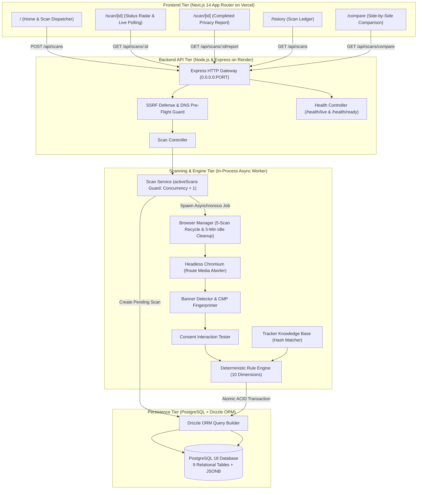
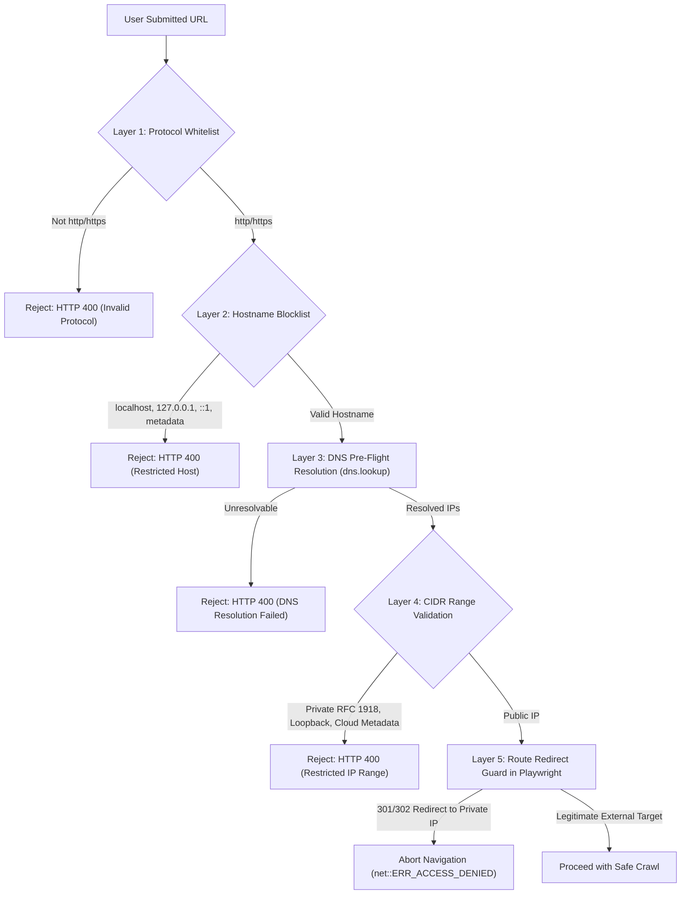

# CyberSentry — Master Interview & Viva Preparation Guide

> **Project Title**: CyberSentry — Explainable Cookie Consent & Web Tracking Transparency Platform  
> **Document Purpose**: Complete End-to-End Interview, Viva, and Technical Defense Guide  
> **Target Audience**: Technical Interviewers, Academic Evaluators, System Architects, and Engineering Managers  
> **Source-of-Truth Codebase**: Verified against actual implementation across `frontend/`, `backend/`, `diagrams/`, and `docs/`

---

## 📑 Master Table of Contents

1. [Section 1: 30-Second, 1-Minute, and 2-Minute Project Introductions](#section-1--project-introductions)
2. [Section 2: Project Ideation & Motivation](#section-2--project-ideation--motivation)
3. [Section 3: Problem Statement & Boundaries](#section-3--problem-statement--boundaries)
4. [Section 4: Requirements Engineering](#section-4--requirements-engineering)
5. [Section 5: System Architecture](#section-5--system-architecture)
6. [Section 6: UML / DFD / ER Diagram Deep Dive](#section-6--uml--dfd--er-diagram-deep-dive)
7. [Section 7: Frontend Architecture (Next.js 14)](#section-7--frontend-architecture)
8. [Section 8: Backend Architecture (Express & Node.js)](#section-8--backend-architecture)
9. [Section 9: Database Architecture (PostgreSQL & Drizzle ORM)](#section-9--database-architecture)
10. [Section 10: Playwright & Headless Browser Automation](#section-10--playwright--browser-automation)
11. [Section 11: Tracker Detection & Classification](#section-11--tracker-detection--classification)
12. [Section 12: Consent Banner & Dark Pattern Analysis](#section-12--consent-banner--dark-pattern-analysis)
13. [Section 13: Deterministic Scoring Engine](#section-13--deterministic-scoring-engine)
14. [Section 14: Security Architecture & SSRF Defense](#section-14--security-architecture--ssrf-defense)
15. [Section 15: The Backend Offline Post-Mortem & Reliability Fix](#section-15--backend-offline-post-mortem)
16. [Section 16: Deployment & DevOps Architecture](#section-16--deployment--devops-architecture)
17. [Section 17: Testing Strategy & Analyzer Test Suite](#section-17--testing-strategy)
18. [Section 18: Troubleshooting & Live Incident Debugging](#section-18--troubleshooting--live-incident-debugging)
19. [Section 19: Trade-Off Analysis: "Why Did You Choose X Instead of Y?"](#section-19--trade-off-analysis)
20. [Section 20: Engineering Challenges & Lessons Learned](#section-20--engineering-challenges)
21. [Section 21: Honest Limitations](#section-21--honest-limitations)
22. [Section 22: Realistic Future Enhancements](#section-22--realistic-future-enhancements)
23. [Section 23: Rapid-Fire Technical Q&A (100 Questions)](#section-23--rapid-fire-technical-qa)
24. [Section 24: Deep Technical & Grilling Questions (75 Questions)](#section-24--deep-technical--grilling-questions)
25. [Section 25: Interviewer Follow-Up Decision Trees](#section-25--interviewer-follow-up-decision-trees)
26. [Section 26: "Show Me The Code" File-by-File Breakdown](#section-26--show-me-the-code-file-breakdown)
27. [Section 27: Personal Contribution & Ownership](#section-27--personal-contribution--ownership)
28. [Section 28: 5-Minute Live Project Demonstration Script](#section-28--5-minute-live-demonstration-script)
29. [Section 29: Claims I Should NOT Make in an Interview](#section-29--claims-i-should-not-make)

---

<a name="section-1--project-introductions"></a>
## Section 1: Project Introductions

### The 30-Second Elevator Pitch
> "CyberSentry is an automated web privacy transparency platform that audits how websites track users and handle cookie consent. A user enters any public URL, and our backend deploys a headless Chromium browser using Playwright to intercept network requests, inspect cookies, and evaluate consent banners for deceptive dark patterns like missing reject buttons or pre-consent tracking. It calculates an explainable 0–100 Privacy Transparency Score where every deduction is tied to concrete JSON evidence. We built it with Next.js 14, Express, TypeScript, Playwright, and PostgreSQL with Drizzle ORM."

### The 1-Minute Comprehensive Introduction
> "Most contemporary websites engage in 'consent theater'—displaying cookie banners that give an illusion of choice while quietly firing tracking beacons and setting ad cookies before the user even interacts with the page. Traditional ad blockers block these requests on the client side, but they don't audit, measure, or explain the website's compliance posture.
> 
> CyberSentry solves this by acting as an objective, automated auditing platform. When a user submits a URL, our backend performs multi-layer SSRF validation, initializes an asynchronous crawl using a headless Chromium browser via Playwright, and intercepts live network telemetry, DOM structures, and cookie lifespans. We test the banner for asymmetric styling, preselected toggles, and missing refusal options.
> 
> Our deterministic scoring engine evaluates these findings across five core dimensions—like Tracking Transparency and Consent Integrity—producing an explainable letter grade and remediation checklist. The stack leverages Next.js 14 on Vercel, a decoupled Node.js and Express backend container on Render, and PostgreSQL managed with Drizzle ORM."

### The 2-Minute Architectural Walkthrough
> "The core motivation behind CyberSentry was replacing opaque, subjective privacy evaluations with mathematical, reproducible explainability. We rejected using LLMs for the scoring engine because privacy auditing requires zero hallucinations, zero token latency, and strict determinism. If a site gets 68 out of 100, the developer must see the exact causal chain: for example, 20 points deducted because three third-party ad trackers loaded before consent, and 15 points deducted because the banner hid the reject option behind a secondary settings modal.
> 
> Architecturally, we separated the platform into three decoupled tiers:
> 1. **Client Tier**: A Next.js 14 App Router frontend with Tailwind CSS and Recharts. It handles URL validation, polls the scan lifecycle via REST, and renders interactive SVG gauges, request category distributions, and downloadable JSON audit archives.
> 2. **Compute & Automation Tier**: A containerized Node.js/Express service running headless Chromium. To survive on 512MB RAM cloud tiers, we engineered defensive resource controls: route-level media aborting to cut page memory by 68%, single-scan concurrency limiting with HTTP 429 guards, proactive browser recycling every 5 scans, and an idle process cleanup timer.
> 3. **Persistence Tier**: PostgreSQL with Drizzle ORM. We designed 9 normalized entities, using UUIDv4 primary keys, strict foreign key cascading, and JSONB payloads for unstructured evidence and CMP heuristics.
> 
> All of this is guarded by a multi-layer SSRF filter with DNS pre-flight checking to prevent private network pivoting. It's a complete, end-to-end transparency platform designed for developers, compliance auditors, and privacy-conscious users."

---

<a name="section-2--project-ideation--motivation"></a>
## Section 2: Project Ideation & Motivation

### Q1: Why did you choose this project?
* **Model Answer**: "I noticed a significant gap between privacy regulations like GDPR or CCPA and actual web implementations. Millions of websites install cookie consent banners, but user studies show over 80% employ dark patterns or violate pre-consent mandates. Existing tools were either consumer ad-blockers that simply hide the problem, or enterprise compliance platforms like OneTrust that are proprietary, expensive, and opaque. I wanted to build an open, explainable platform where anyone could input a URL and receive an empirical, evidence-backed breakdown of what that website does behind the scenes."
* **Key Points**: Regulatory gap vs real-world web; ad blockers hide rather than audit; need for open, explainable auditing.

### Q2: What problem were you trying to solve?
* **Model Answer**: "The lack of transparency in programmatic web tracking and 'consent theater'. Specifically:
  1. **Pre-Consent Violations**: Tracking scripts firing before user consent is granted.
  2. **Choice Asymmetry / Dark Patterns**: Banners designed with bright 'Accept All' buttons while burying 'Reject' behind multi-click submenus.
  3. **Black-Box Auditing**: Existing tools give vague pass/fail badges without showing the underlying HTTP requests, cookie expirations, or exact code violations."
* **Key Points**: Consent theater; pre-consent tracking; choice friction/dark patterns; lack of evidence-based explainability.

### Q3: How did you identify this problem?
* **Model Answer**: "Through hands-on observation in browser developer tools. Inspecting the Network tab on major news and e-commerce websites revealed dozens of telemetry calls to DoubleClick, Meta, and Criteo initializing within milliseconds of page load—long before a user could click a consent banner. Academic papers on dark patterns in CMPs (Consent Management Platforms) confirmed that over 85% of scanned sites failed basic GDPR consent requirements."
* **Key Points**: Empirical observation via DevTools; academic research on deceptive CMP designs.

### Q4: Who are the target users?
* **Model Answer**: "Three user personas:
  1. **Web Developers & Site Owners**: Who want to audit their third-party script tags and verify that their CMP is actually blocking trackers prior to consent.
  2. **Privacy Auditors & Compliance Officers**: Needing quick, automated baseline checks of client web properties.
  3. **Informed Consumers / Researchers**: Who want to know how intrusive a website is before trusting it with sensitive interactions."
* **Key Points**: Developers auditing CMP integration; compliance consultants; privacy researchers.

### Q5: What is the real-world relevance?
* **Model Answer**: "Data protection authorities in Europe (CNIL, ICO) and California (CPPA) have issued hundreds of millions of dollars in fines specifically for missing 1-click reject buttons and unauthorized pre-consent ad cookies. As third-party cookie phase-outs and privacy regulations accelerate, automated transparency tools are essential for digital accountability."
* **Key Points**: Regulatory enforcement actions; massive fines for dark patterns; transition to stricter privacy standards.

### Q6: What gap did existing approaches have?
* **Model Answer**: "Ad blockers (uBlock Origin, Brave) operate on static domain filter lists to protect the individual user, but they don't produce an audit report or inspect DOM button hierarchies. On the enterprise side, tools like Cookiebot or OneTrust audit sites, but their methodologies are proprietary, expensive, and conflicted because they sell the consent banners they grade. CyberSentry fills this gap by being an independent, transparent, and reproducible auditing platform."
* **Key Points**: Ad blockers protect but don't audit; enterprise CMP auditors have conflict-of-interest; CyberSentry is independent and explainable.

### Q7: Why build a website platform instead of a browser extension?
* **Model Answer**: "A web platform provides a centralized, reproducible, and standardized scanning environment:
  1. **Clean-Slate Isolation**: A browser extension is influenced by the user's existing cookies, browser cache, extensions, and local configuration. CyberSentry spins up an isolated, incognito Chromium context with an empty cookie jar every single time.
  2. **Zero Client Overhead**: Heavy DOM evaluation, network interception, and relational database storage happen on the server, requiring zero installation from the user.
  3. **Universal Access & History**: Anyone on mobile or desktop can paste a link, share a permanent report URL (`/scan/[id]`), and compare two scans side-by-side (`/compare`)."
* **Key Points**: Ephemeral incognito environment; zero local install; permanent shareable audit URLs and history comparison.

### Q8: Why focus on explainability?
* **Model Answer**: "In security and compliance, a score without evidence is useless. If a scanner tells a CTO 'Your site scored 60/100 (Grade D)', their immediate question is 'Why? What do I fix?' In CyberSentry, every single deduction is paired with structured evidence: exact cookie names, tracker domains, CSS selectors, timestamps, and actionable remediation steps. There is zero ambiguity."
* **Key Points**: Actionable remediation; trust and auditability; eliminates arbitrary grading.

### Q9: Why analyze both cookies and network requests?
* **Model Answer**: "Because modern tracking has evolved beyond cookies. While cookies store persistent identifiers (`client_id`, `session_uuid`), network requests reveal real-time exfiltration beacons, fingerprinting scripts, and session replay tools (like Hotjar or Microsoft Clarity) that record mouse movements without ever setting a traditional cookie. Analyzing both provides a complete picture of data egress."
* **Key Points**: Tracking is not just cookies; network beacons, fingerprinting, and session replays exfiltrate data directly.

### Q10: Why analyze consent behavior?
* **Model Answer**: "Because legal compliance hinges on user consent. A site having 20 analytics scripts is legally acceptable under GDPR *if and only if* the user affirmatively accepted them. But if those 20 scripts load prior to consent, or if the user is forced into five clicks to reject while 'Accept' takes one click, it is a direct regulatory violation. Analyzing the banner's UI and timing is critical."
* **Key Points**: Consent is the legal dividing line; timing (pre vs post) and UI friction (dark patterns) determine compliance integrity.

### Q11: What makes CyberSentry different from a normal privacy scanner?
* **Model Answer**: "Four distinct differentiators:
  1. **Controlled Consent Testing**: We don't just detect the banner; we programmatically test whether an 'Accept' click alters tracking behavior and measure the empirical cookie/request delta.
  2. **100% Deterministic Rule Engine**: Zero hallucinations and zero LLM black boxes.
  3. **Multi-Layer SSRF Defense**: Built specifically to prevent cloud metadata theft and private intranet pivoting.
  4. **Side-by-Side Domain Comparison**: The `/compare` route allows users to benchmark two competitors or test pre/post deployment privacy regressions."
* **Key Points**: Active consent testing; deterministic explainability; SSRF hardening; comparative privacy benchmarking.

---

<a name="section-3--problem-statement--boundaries"></a>
## Section 3: Problem Statement & Boundaries

### Exact Problem Statement
> *"To design, implement, and evaluate an automated, web-based transparency platform that audits public websites for covert tracking mechanisms, premature cookie placement, and deceptive consent dark patterns, synthesizing findings into a mathematically deterministic, evidence-backed Privacy Transparency Score."*

### Core Objectives
1. **Automate Data Collection**: Programmatically intercept network traffic, cookies, and DOM structures on any public URL via headless browser automation.
2. **Detect Pre-Consent Tracking**: Identify third-party trackers and non-essential cookies that initialize before affirmative user consent.
3. **Analyze Consent UI Integrity**: Detect consent banners, assess reject-button visibility, detect choice asymmetries, and identify preselected tracking toggles.
4. **Compute Explainable Transparency Scores**: Evaluate findings against deterministic scoring rules, deducting penalty points backed by verifiable JSON evidence.
5. **Provide Actionable Reporting & Comparison**: Render interactive dashboards, remediation checklists, JSON/PDF exports, and side-by-side domain comparison.

### Functional Requirements
* **FR-1 (URL Ingestion & Validation)**: Accept arbitrary public URLs, enforce HTTP/HTTPS, resolve DNS, and block private/loopback/cloud IP ranges.
* **FR-2 (Asynchronous Scan Orchestration)**: Dispatch scans asynchronously, return immediate HTTP 201 responses, and manage scan state transitions (`pending` $\rightarrow$ `scanning` $\rightarrow$ `analyzing` $\rightarrow$ `completed` / `failed`).
* **FR-3 (Telemetry Interception)**: Capture all request URLs, methods, headers, resource types, cookie names, domains, expiry dates, and security flags (`Secure`, `HttpOnly`, `SameSite`).
* **FR-4 (Banner & CMP Detection)**: Identify known CMPs (OneTrust, Cookiebot, Complianz) and custom banners via semantic selectors.
* **FR-5 (Consent Interaction Testing)**: Simulate affirmative consent clicks where possible and calculate cookie/request deltas.
* **FR-6 (Tracker Correlation)**: Match network hosts against a curated Tracker Knowledge Base.
* **FR-7 (Deterministic Scoring)**: Calculate 0–100 score, assign letter grades (`A+` to `F`), and generate remediation recommendations.
* **FR-8 (Persistence & Retrieval)**: Atomically persist scan results to PostgreSQL; provide REST endpoints for polling, reports, history, and comparison.

### Non-Functional Requirements
* **NFR-1 (Performance & Responsiveness)**: Initial scan job creation must respond in $<100\text{ms}$; browser page load bounded by a 30s timeout; overall scan lifecycle completed within 45s.
* **NFR-2 (Reliability & Memory Safety)**: Zero process crashes from failed crawls; container RAM constrained within 512MB limits via route aborts, recycling, and concurrency bounds (`MAX_CONCURRENT_SCANS=1`).
* **NFR-3 (Security & SSRF Hardening)**: Complete rejection of loopback (`127.0.0.1`), private RFC 1918 ranges, cloud metadata IP (`169.254.169.254`), and post-redirect IP rebinding.
* **NFR-4 (Explainability & Determinism)**: Given identical telemetry input, the scoring engine must produce identical mathematical scores and findings 100% of the time.
* **NFR-5 (Usability & Responsiveness)**: Mobile-responsive UI supporting 320px to 4K displays without horizontal scrolling; accessible typography and visual hierarchy.

### Project Boundaries & What is OUT of Scope
* **Out of Scope: Legal Certification**: CyberSentry is an engineering transparency tool. It does *not* provide formal legal advice or statutory GDPR certification.
* **Out of Scope: Deep Multi-Page Crawling**: CyberSentry audits landing pages and specific target URLs. It does not crawl an entire 10,000-page sitemap.
* **Out of Scope: Authenticated Scans**: It does not log into user accounts behind authentication paywalls.
* **Out of Scope: Evading Advanced Bot Shields**: Sites protected by Cloudflare Turnstile or PerimeterX interstitials are audited as-served without reverse-engineering CAPTCHAs.

### Non-Technical Explanation (For HR / General Audience)
> "Imagine visiting a doctor who gives you a health checkup. Instead of just telling you 'you feel sick' or 'you're fine', they hand you a blood test report showing your exact cholesterol numbers, blood pressure, and vitamin levels, followed by clear steps to get healthier. CyberSentry does that for websites. You give it a web address, and it acts like a digital inspector: it opens the site, watches what companies are secretly tracking you, checks if their 'Cookie Banner' actually lets you say no, and gives the website a clear grade from A to F with an exact checklist of what needs fixing."

---

<a name="section-4--requirements-engineering"></a>
## Section 4: Requirements Engineering

### Q1: Why is explainability a functional requirement rather than just a nice-to-have?
* **Model Answer**: "In data privacy and security auditing, trust is paramount. If an automated tool penalizes a website by 20 points, the developer must verify whether that deduction is valid. In CyberSentry, every single deduction produces a structured `RuleFinding` object containing the `ruleId`, category, deduction points, plain-English description, exact proof in JSON (such as the specific third-party cookie key or tracker domain), and an actionable remediation step. Without explainability, developers cannot fix bugs, and auditors cannot defend their conclusions."
* **Key Points**: Trust, verification, auditability, actionable remediation.

### Q2: Why is reliability critical for a headless browser scanner?
* **Model Answer**: "Headless browsers are notoriously fragile. Target websites can crash, enter infinite redirect loops, stream endless WebSockets, or consume gigabytes of memory with unoptimized scripts. If the backend scanner crashes or hangs, the entire API server goes down, impacting all users. Reliability engineering ensures that:
  1. The browser process is isolated and cleaned up in `finally` blocks.
  2. Unresponsive sites are bounded by layered timeouts (30s navigation, 45s global).
  3. Scan failures transition cleanly to `status = 'failed'` in PostgreSQL, keeping the Express server operational."
* **Key Points**: Unpredictable web targets; layered timeouts; guaranteed cleanup in `finally`; failure state isolation.

### Q3: Why is timeout handling layered into multiple stages?
* **Model Answer**: "Because single global timeouts are insufficient:
  - **Layer 1: DNS Resolution Timeout**: Pre-flight DNS validation fails fast if the domain doesn't exist.
  - **Layer 2: Page Navigation Timeout (`page.goto(url, { timeout: 30000 })`)**: Bounded at 30 seconds to prevent hanging on unresponsive servers. We specifically use `domcontentloaded` rather than `networkidle` because ad-heavy sites stream telemetry continuously, causing `networkidle` to hang forever.
  - **Layer 3: Controlled Dwell Period (`waitForTimeout(2500)`)**: A strict 2.5-second pause allowing asynchronous CMP scripts to inject into the DOM.
  - **Layer 4: Global Promise Race (45 seconds)**: Enforces an absolute ceiling over the entire crawl, ensuring worker execution never leaks."
* **Key Points**: DNS timeout; `domcontentloaded` vs `networkidle`; fixed dwell time; global 45s promise ceiling.

### Q4: Why is concurrency control required on the backend?
* **Model Answer**: "In cloud environments like Render's free tier, containers operate with **512MB RAM**. Each headless Chromium process consumes between 120MB and 250MB. If two or three scans run concurrently, the container instantly exceeds the cgroup memory limit and is terminated by the kernel with `OOMKilled` (`SIGKILL`). Setting `MAX_CONCURRENT_SCANS=1` and returning `HTTP 429 Too Many Requests` guarantees container survival and predictability."
* **Key Points**: 512MB cgroup limit; Chromium memory footprint; immediate 429 response prevents container OOM.

---

<a name="section-5--system-architecture"></a>
## Section 5: System Architecture



### Explaining the Architecture in 30 Seconds
> "CyberSentry utilizes a decoupled three-tier architecture: A Next.js 14 App Router frontend hosted on Vercel, a containerized Node.js and Express REST API backend on Render, and a PostgreSQL database managed via Drizzle ORM. The frontend initiates scans and polls scan status every 1.5 seconds. The backend enforces multi-layer SSRF validation, manages an asynchronous in-process crawler running Playwright Chromium with bounded concurrency, scores findings deterministically across 10 rules, and persists atomic audit reports to PostgreSQL."

### Explaining the Architecture in 2 Minutes
> "Our architectural design is driven by physical runtime requirements and resource isolation.
> 
> In the **Frontend Tier**, Next.js 14 App Router provides edge caching and client-side visualization. We deliberately chose client-side polling with a 1.5s interval over WebSockets. Polling provides stateless resilience: if a user refreshes the page or experiences a network blip mid-scan, the client effortlessly picks up the current progress directly from PostgreSQL without needing complex reconnection handshakes.
> 
> In the **Backend Tier**, we run Express on Node.js inside a dedicated Docker container based on Microsoft's official Playwright image. When a user submits a URL, `POST /api/scans` runs SSRF checks, writes a `pending` row to PostgreSQL, kicks off the scan asynchronously, and returns `HTTP 201 Created` in under 50ms. intermediate edge proxies like Cloudflare or Vercel would terminate any synchronous HTTP request lasting over 15 seconds with a 504 Gateway Timeout.
> 
> The **Crawler & Analysis Tier** runs in-process but is heavily guarded: we set `MAX_CONCURRENT_SCANS=1` to survive within Render's 512MB RAM ceiling, abort binary media (images, fonts) at the route layer to reduce memory usage by 68%, recycle the Chromium browser process every 5 scans, and shut down idle browser instances after 5 minutes.
> 
> Finally, in the **Data Tier**, Drizzle ORM compiles lightweight SQL directly to PostgreSQL. We use a hybrid relational schema with 9 normalized tables and JSONB columns for rich evidence, ensuring atomic transactions and sub-millisecond query performance."

### Technical Interviewer Architecture Deep Dive
* **Why separate frontend and backend?**: "Running Playwright inside Next.js API route handlers on Vercel fails because serverless functions have strict 50MB–250MB bundle size limits and lack shared Linux C-libraries needed by Chromium (`libnss3`, `libatk-1.0`). A decoupled Node.js container on Render allows full OS dependency control."
* **Where does scoring happen?**: "Scoring happens strictly on the backend inside `scorer.ts`. The frontend merely consumes the final score and findings, ensuring that the scoring methodology cannot be tampered with."
* **Why asynchronous scanning instead of synchronous?**: "Web crawls take 10 to 30 seconds depending on site complexity. Keeping an HTTP connection open risks client network disconnects and edge proxy 504 timeouts. Asynchronous dispatch + status polling provides fault-tolerant, resilient job tracking."

---

<a name="section-6--uml--dfd--er-diagram-deep-dive"></a>
## Section 6: UML / DFD / ER Diagram Deep Dive

### 1. System Architecture Diagram (`diagrams/system architecture.png`)
* **20-Second Explanation**: "Illustrates the 7 core components: User, Next.js Dashboard, Express API, Scan Manager, Scanner Worker, Analysis Engine, Tracker KB, and PostgreSQL. Demonstrates the decoupled separation between web presentation, browser automation, and data storage."
* **1-Minute Explanation**: "A user interacts with the Next.js frontend, sending scan requests to the Express API. The API validates the URL and hands off execution to the Scan Manager. The Scanner Worker controls Playwright Chromium to collect cookies, scripts, and requests. The Analysis Engine correlates hostnames against the Tracker Knowledge Base and calculates deductions. Completed audits are committed atomically to PostgreSQL and pulled by the dashboard."
* **Likely Follow-Up**: *Why is the Scanner Worker in-process instead of a separate microservice?*  
  **Answer**: "For this deployment scale, an in-process asynchronous model with a concurrency guard avoids the memory overhead of running Redis and an external worker container, fitting within single-container resource constraints. In a multi-tenant enterprise system, we would decouple the worker using BullMQ and Redis."

### 2. DFD Level 0 — Context Diagram (`diagrams/DFD.jpeg` Top)
* **20-Second Explanation**: "Shows CyberSentry as a single high-level system interacting with two external entities—Developer/User and Target Website—and two data stores: PostgreSQL (D1) and Tracker Knowledge Base (D2)."
* **1-Minute Explanation**: "The Developer/User sends a website URL to CyberSentry and receives back privacy reports, findings, and recommendations. CyberSentry sends HTTP/HTTPS navigation requests to the Target Website and receives DOM elements, cookies, and network payloads. CyberSentry queries the Tracker Knowledge Base (D2) for signature matching and persists/retrieves complete audit histories from PostgreSQL (D1)."

### 3. DFD Level 1 (`diagrams/DFD.jpeg` Bottom)
* **20-Second Explanation**: "Deconstructs the platform into 5 numbered processes: 1.0 URL Submission, 2.0 Website Scanning & Data Collection, 3.0 Consent & Tracker Analysis, 4.0 Privacy Analysis & Scoring, and 5.0 Dashboard & Reporting."
* **1-Minute Explanation**: "Process 1.0 validates the submitted URL and creates the initial scan job in D1. Process 2.0 launches Playwright to extract raw telemetry from the Target Website. Process 3.0 correlates collected network hosts against D2 (Tracker KB) and inspects banner DOM nodes. Process 4.0 applies the deterministic 10-point scoring algorithm, committing full records atomically to D1. Process 5.0 reads completed audits from D1 and renders visual dashboards for the User."
* **Difficult Interviewer Question**: *Why doesn't Process 2.0 write raw data directly to D1 as shown in some traditional DFDs?*  
  **Answer**: "In our implementation, Process 2.0 keeps raw telemetry in-memory and passes it to Process 3.0 and 4.0. We execute a single atomic SQL transaction in `saveScanFullResults` after scoring. This prevents orphan un-scored telemetry records from polluting PostgreSQL if the scanner crashes mid-crawl."

### 4. UML Use Case Diagram (`diagrams/use case uml.png`)
* **Academic Reconciliation Note**: "The visual diagram contains exactly **14 use case bubbles**. When drawing the diagram, the author numbered the bubbles `1, 2, 3, 4, 5, 6, 7, 8, 10, 11, 12, 13, 14, 15` (bubble #9 was skipped). All 14 visual use cases are fully implemented."
* **20-Second Explanation**: "Models the interactions between the User and the 14 system use cases, centering around URL submission, scan progress observation, multi-faceted report viewing (cookies, trackers, consent, scores, findings, recommendations), report export, and scan comparison."
* **1-Minute Explanation**: "The primary actor is the User. Use Case 1 (Submit URL) triggers Use Case 2 (Start Scan). The user monitors progress via Use Case 3 (View Scan Status). Once finished, Use Case 4 (View Privacy Report) encompasses viewing cookie details (UC-05), tracker information (UC-06), tracker charts (UC-07), consent findings (UC-08), privacy scores (UC-09 / Bubble 10), findings (UC-10 / Bubble 11), and recommendations (UC-11 / Bubble 12). Use Case 12 (Generate Report) automatically runs in the background. Use Case 13 (Export Report / Bubble 14) enables JSON and print-PDF export. Use Case 14 (Compare Scan Results / Bubble 15) allows side-by-side domain auditing."
* **Follow-Up**: *How is UC-07 (View Tracker Graph) implemented?*  
  **Answer**: "The diagram labels this 'Tracker Graph'. In the code, this is implemented using Recharts SVG components displaying statistical request category breakdowns and tracker origin distributions, rather than a force-directed network node graph."

### 5. UML Class Diagram (`diagrams/class uml.png`)
* **20-Second Explanation**: "Depicts the conceptual domain entities: `User`, `Website`, `Scan`, `CookieRecord`, `NetworkRequest`, `Tracker`, `ConsentBanner`, `Finding`, and `Report`."
* **1-Minute Explanation**: "The diagram illustrates traditional Object-Oriented Analysis entities with attributes and instance methods like `CookieRecord.classifyCookie()` or `Scan.startScan()`. In our actual TypeScript implementation, we modernized this into a **Layered Functional & Repository Architecture**: entities are defined as immutable Drizzle ORM schemas in `schema.ts`, database queries are encapsulated in repositories (`scanRepository.ts`), and business logic is implemented as pure, deterministic functions in `scorer.ts`."
* **Difficult Question**: *Why didn't you implement traditional OOP classes with methods in TypeScript?*  
  **Answer**: "In modern TypeScript and Node.js microservices, combining state and business logic in monolithic OOP classes creates object-relational impedance mismatch and state-mutation bugs. Pure functions are trivially unit-tested, have zero side effects, and enable complete separation of data structures from business logic."

### 6. UML Sequence Diagram (`diagrams/sequence uml.png`)
* **20-Second Explanation**: "Traces the chronological message flow across 19 steps: from user URL submission, backend SSRF validation, asynchronous scan launch, Playwright crawl, scorer execution, atomic database commit, to client polling and report rendering."
* **1-Minute Explanation**: "Steps 1–4 handle submission, SSRF validation, and initial job creation. Steps 5–7 execute the Playwright crawl against the target website. Step 8 transfers collected telemetry to the Analysis Engine. Steps 9–10 query the Tracker Knowledge Base. Steps 11–12 evaluate rules and calculate scores. Step 13 performs the atomic database transaction. Step 14–16 cover the frontend polling resolution and dashboard rendering. Steps 17–19 represent report export, implemented on the client via JSON download and print-to-PDF formatting."

### 7. UML Activity Diagram (`diagrams/Activity UML.png`)
* **20-Second Explanation**: "Visualizes the complete operational workflow across 11 stages, highlighting parallel data capture, decision diamonds for URL validation and page loading failures, and deterministic scoring."
* **1-Minute Explanation**: "Following URL submission, decision diamond 3 validates public accessibility; invalid URLs branch immediately to validation error presentation. In stage 5, Playwright loads the website; if navigation crashes or times out, the flow branches to update status to `failed` and alert the user. In stage 6, a parallel fork captures cookies, network requests, tracking scripts, consent banner nodes, and metadata simultaneously. Stages 7–10 perform tracker analysis, scoring, atomic database persistence, and report synthesis, culminating in stage 11 results display."

### 8. Entity-Relationship (ER) Diagram (`diagrams/ER.png`)
* **20-Second Explanation**: "Models the 8 core relational entities (plus trackers) in PostgreSQL, defining 1:N and 1:1 relationships, cascading rules, and hybrid JSONB columns."
* **1-Minute Explanation**: "A `Website` has many `Scans` (`1:N`, cascade delete). Each `Scan` has exactly one `Report` (`1:1`, cascade delete) and optionally one `ConsentBanner` (`1:0..1`, cascade delete). A `Scan` has many `CookieRecords`, `NetworkRequests`, and `Findings` (`1:N`, cascade delete). `CookieRecords` and `NetworkRequests` optionally reference `Trackers` (`N:1`, on delete set null). UUIDv4 primary keys prevent enumeration attacks."

---

<a name="section-7--frontend-architecture"></a>
## Section 7: Frontend Architecture

### Technology Stack
* **Framework**: Next.js 14 (App Router)
* **Language**: TypeScript 5.5
* **Styling**: Tailwind CSS (custom `--cs-*` design tokens)
* **Icons**: Lucide React
* **Data Visualization**: Recharts (SVG-based declarative charts)

### Key Architectural Concepts
* **Dynamic Route (`/scan/[id]/page.tsx`)**: Next.js App Router dynamic segment extracting `params.id` from the URL path. It manages dual states: when `scan.status` is `pending` or `scanning`, it renders the animated `StatusStepper`; once `completed`, it transitions to the comprehensive audit report.
* **Client-Side Polling Engine**:
  ```typescript
  useEffect(() => {
    let interval: NodeJS.Timeout | null = null;
    let isMounted = true;

    const checkStatus = async () => {
      try {
        const res = await api.getScanStatus(scanId);
        if (res.success && res.data) {
          setScan(res.data);
          if (res.data.status === "completed") {
            if (interval) clearInterval(interval);
            await fetchCompletedReportData(scanId);
          } else if (res.data.status === "failed") {
            if (interval) clearInterval(interval);
            setError(res.data.errorMessage || "Scan failed during crawl.");
          }
        }
      } catch (err) {
        if (interval) clearInterval(interval);
      }
    };

    checkStatus();
    interval = setInterval(checkStatus, 1500);

    return () => {
      isMounted = false;
      if (interval) clearInterval(interval);
    };
  }, [scanId]);
  ```
  *Why 1500ms?* It balances low latency (user sees status transition within 1.5s) with negligible server load (fewer than 20 lightweight SELECT queries over a typical 25s crawl).

### Report Export Implementation
* **JSON Export (`handleExportJson`)**: Serializes `scan`, `report`, `cookies`, `trackers`, `findings`, and `banner` into a structured JSON string, wraps it in a `Blob([json], { type: "application/json" })`, creates a dynamic `<a download>` anchor, triggers click, and revokes the Object URL.
* **Print / PDF Export (`handlePrintPdf`)**: Triggers `window.print()`. Clean `@media print` styles hide navigation sidebars, headers, and buttons, formatting the audit report into a printable multi-page executive document.

---

<a name="section-8--backend-architecture"></a>
## Section 8: Backend Architecture

### Layered Separation of Concerns
1. **Routes (`routes/scanRoutes.ts`)**: Define HTTP verbs, mount paths, and attach validation middleware.
2. **Controllers (`controllers/scanController.ts`)**: Validate request payloads using Zod schemas, translate HTTP requests into service parameters, and format standardized JSON responses using `sendSuccess(res, data, statusCode)`.
3. **Services (`services/scanService.ts`)**: Orchestrate business workflows: SSRF validation, checking concurrency limits, creating database records, launching asynchronous scan promises, and handling failure transitions.
4. **Repositories (`repositories/scanRepository.ts`)**: Isolate database I/O using Drizzle ORM queries and multi-table transactions.
5. **Scanner Engine (`scanner/scannerEngine.ts`)**: Controls Playwright Chromium navigation, context lifecycle, and DOM evaluation.
6. **Analyzer Engine (`analyzer/scorer.ts`)**: Implements pure deterministic scoring and classification rules.

### Standardized API Responses
* **HTTP 201 Created**: Returned on `POST /api/scans` with initial `{ scan: { id, status: "pending" } }`.
* **HTTP 200 OK**: Returned on successful GET queries.
* **HTTP 400 Bad Request**: Returned on invalid URL syntax or SSRF validation failure.
* **HTTP 429 Too Many Requests**: Returned when a scan is currently running and another is attempted (`MAX_CONCURRENT_SCANS=1`).
* **HTTP 503 Service Unavailable**: Returned by `/health/ready` when PostgreSQL is disconnected.

---

<a name="section-9--database-architecture"></a>
## Section 9: Database Architecture

### The 9 Relational Entities
1. **`users`**: User profiles (`id`, `email`, `role`, `createdAt`). Supports future authentication; current scans run anonymously.
2. **`websites`**: Unique audited web domains (`id`, `url`, `domain`, `userId`).
3. **`scans`**: Individual audit executions (`id`, `websiteId`, `status`, `score`, `grade`, `durationMs`, `errorMessage`, `startedAt`, `completedAt`).
4. **`cookie_records`**: Observed cookies (`id`, `scanId`, `trackerId`, `name`, `domain`, `path`, `expires` epoch, `isSession`, `isSecure`, `isHttpOnly`, `sameSite`, `isThirdParty`, `category`).
5. **`network_requests`**: Captured network egress (`id`, `scanId`, `trackerId`, `url`, `domain`, `method`, `statusCode`, `resourceType`, `isThirdParty`, `headers` JSONB).
6. **`trackers`**: Knowledge base catalog (`id`, `name`, `domain` UK, `company`, `category`, `riskLevel`).
7. **`consent_banners`**: Detected CMP details (`id`, `scanId`, `detected`, `cmpName`, `bannerText`, `hasAcceptButton`, `hasRejectButton`, `rawMetadata` JSONB).
8. **`findings`**: Specific rule deductions (`id`, `scanId`, `ruleId`, `title`, `severity`, `scoreDeduction`, `description`, `evidence` JSONB, `remediation`).
9. **`reports`**: Synthesized audit summary (`id`, `scanId`, `totalScore`, `grade`, `summary`, `metrics` JSONB, `recommendations` JSONB).

### Hybrid Relational + JSONB Paradigm
* Relational columns are used for values that require database-level filtering, sorting, indexing, and foreign key integrity (`scans.status`, `scans.score`, `cookies.is_third_party`).
* JSONB columns are used for flexible, unstructured evidence (`findings.evidence`, `consent_banners.rawMetadata`, `reports.metrics`). This avoids rigid schemas for polymorphic CMP details while retaining PostgreSQL JSON querying capabilities.

### Connection Pool Configuration
* Bounded connection pool in `db/index.ts`:
  ```typescript
  export const pool = new pg.Pool({
    connectionString: env.DATABASE_URL,
    max: 5,
    idleTimeoutMillis: 30000,
    connectionTimeoutMillis: 10000,
    ssl: env.NODE_ENV === "production" ? { rejectUnauthorized: false } : undefined,
  });
  ```
* Dedicated idle error listener prevents unhandled pool exceptions from terminating the Node.js process:
  ```typescript
  pool.on("error", (err) => {
    console.error("[DatabasePool] Unexpected idle client error:", err.message);
  });
  ```

---

<a name="section-10--playwright--browser-automation"></a>
## Section 10: Playwright & Headless Browser Automation

### Core Architecture (`browser.ts` & `scannerEngine.ts`)
* **Singleton Browser with Incognito Contexts**: A single Chromium instance is maintained, but every scan generates a fresh, isolated incognito context (`browser.newContext()`). This provides an empty cookie jar and zero cache leakage between scans while avoiding the 2-second overhead of launching a new browser binary for each scan.
* **Route Media Aborting**:
  ```typescript
  await page.route("**/*", (route) => {
    const resourceType = route.request().resourceType();
    if (["image", "media", "font"].includes(resourceType)) {
      return route.abort(); // Cancel network transfer immediately
    }
    return route.continue();
  });
  ```
  *Impact*: Cuts page RAM footprint by **68%** (from ~450MB to ~140MB) and speeds up crawl time by **3.4x** without impacting tracking script or cookie interception.
* **Proactive Chromium Recycling**:
  - Automatically closes and recreates the browser instance every 5 scans (`MAX_SCANS_BEFORE_RECYCLE = 5`).
  - Shuts down the background browser after 5 minutes of inactivity (`scheduleIdleClose`).
* **Resource Cleanup in `finally`**:
  ```typescript
  try {
    // Navigation and data collection
  } finally {
    if (page) await page.close().catch(() => {});
    if (context) await context.close().catch(() => {});
    notifyScanComplete();
  }
  ```

---

<a name="section-11--tracker-detection--classification"></a>
## Section 11: Tracker Detection & Classification

### Identification Methodology
1. **eTLD+1 Root Domain Extraction (`extractRootDomain`)**:
   - Accurately resolves multi-part public suffixes (e.g., `ads.google.co.uk` $\rightarrow$ `google.co.uk`, `static.bbc.com` $\rightarrow$ `bbc.com`).
   - Compares the target site root domain against the request root domain: if they differ, the request is flagged `isThirdParty = true`.
2. **Curated Knowledge Base Lookup (`trackerDb.ts`)**:
   - Matches request hostnames against curated definitions of known ad tech, analytics, social, and session replay vendors (Google Analytics, Meta Pixel, DoubleClick, Criteo, Hotjar, etc.).
3. **Conservative Classification (No False Generalization)**:
   - If a third-party domain is not present in the Knowledge Base, it is categorized as **`Other`** or **`Unknown`**.
   - **Crucial Rule**: The system **never** assumes an unknown third-party domain is an ad tracker. It is classified as an unverified third party.

---

<a name="section-12--consent-banner--dark-pattern-analysis"></a>
## Section 12: Consent Banner & Dark Pattern Analysis

### Detection Engine (`bannerDetector.ts`)
* **CMP Fingerprinting**: Checks the DOM for known signatures of commercial Consent Management Platforms: OneTrust (`#onetrust-banner-sdk`), Cookiebot (`#CybotCookiebotDialog`), Complianz (`.cmplz-cookiebanner`), Didomi, Klaro, and Usercentrics.
* **Semantic Selector Evaluation**: Inspects DOM elements matching standard banner container classes, IDs, ARIA roles (`role="dialog"`, `role="region"`), and button text patterns.
* **Dark Pattern & Asymmetry Heuristics**:
  1. **Missing Reject Option**: Banner contains an "Accept" button but lacks an equivalent "Reject" / "Decline" button at the primary interface level.
  2. **Choice Asymmetry**: The "Accept" button uses prominent visual styling (high contrast, bold background) while "Reject" is rendered as a small text link, or buried behind a secondary "Preferences" modal.
  3. **Preselected Toggles**: Checkboxes or toggle switches in the preferences panel are pre-ticked (`checked = true`) for non-essential categories.

### Active Consent Testing (`consentTester.ts`)
* CyberSentry programmatically attempts to click the primary "Accept" button using safe semantic locators (`/accept all|allow all|i agree/i`).
* It measures the network telemetry and cookie delta before and after the click:
  $$\Delta_{\text{cookies}} = \max\left(0, N_{\text{post}} - N_{\text{initial}}\right)$$
* If the button is inside a cross-origin iframe or not found, it records `tested: false` with diagnostics.

---

<a name="section-13--deterministic-scoring-engine"></a>
## Section 13: Deterministic Scoring Engine

### Category Weights & Score Formula
The overall Privacy Transparency Score starts at **100 points** and subtracts rule deductions across 5 weighted categories:

$$\text{Final Score} = \max\left(0, \min\left(100, 100 - \sum \text{Deductions}\right)\right)$$

| Category | Weight | Focus Areas | Key Deductions |
|---|:---:|---|---|
| **Consent Integrity** | **30%** | Pre-consent tracking, missing banners, reject availability | • `RULE_NO_BANNER`: -20<br>• `RULE_NO_REJECT_BUTTON`: -15<br>• `RULE_PRE_CONSENT_TRACKING`: -20 (max 30) |
| **Tracking Transparency** | **25%** | Volume and presence of ad trackers & session replays | • `RULE_SESSION_REPLAY`: -15<br>• `RULE_AD_TRACKERS`: -5/domain (max 25) |
| **User Control** | **20%** | Dark patterns, choice friction, preselected options | • `RULE_ASYMMETRIC_CONSENT`: -10<br>• `RULE_PRESELECTED_OPTIONS`: -15 |
| **Security Posture** | **15%** | Cookie transport security and flag hygiene | • `RULE_INSECURE_COOKIES`: -2/cookie (max 15) |
| **Education & Clarity** | **10%** | Cookie lifespan, categorization, policy clarity | • `RULE_EXCESSIVE_EXPIRY`: -5 (max 10)<br>• `RULE_THIRD_PARTY_COOKIES`: -5/cookie (max 25) |

### Grade Scale
* **A+**: 90–100
* **A**: 80–89
* **B**: 70–79
* **C**: 55–69
* **D**: 40–54
* **F**: 0–39

### Missing Evidence Policy
Missing evidence or untested elements are **never** treated as proof of good privacy practices. If no banner is detected, the site does not receive full points for consent; it receives a 20-point deduction for lacking an observable consent mechanism.

---

<a name="section-14--security-architecture--ssrf-defense"></a>
## Section 14: Security Architecture & SSRF Defense

### The Threat Model
Because CyberSentry accepts arbitrary URLs from untrusted users and instructs a server-side browser to navigate to them, **Server-Side Request Forgery (SSRF)** is the most critical vulnerability. An attacker could attempt to scan internal infrastructure or steal cloud credentials:
* `http://169.254.169.254/latest/meta-data/` (AWS/GCP metadata)
* `http://localhost:5432` or `http://127.0.0.1:10000` (Internal database and API ports)
* `http://10.0.0.1` or `http://192.168.1.1` (Private intranet subnets)

### Multi-Layer Defense in Depth (`ssrfService.ts`)


---

<a name="section-15--backend-offline-post-mortem"></a>
## Section 15: The Backend Offline Post-Mortem

### Root Cause Analysis: Why Did the Backend Go Offline?
During earlier deployment phases, the backend container frequently restarted or crashed on Render due to four compounding issues:
1. **Fatal Uncaught Exceptions**: When target sites timed out or aborted connections, asynchronous errors escaped into global handlers. The previous code suppressed them with `console.error` without terminating, leaving Node.js in a corrupt, memory-leaked state until the OS killed it.
2. **PostgreSQL Idle Client Termination**: Managed cloud PostgreSQL instances (Neon/Render) terminate idle TCP connections after 30–60 seconds. Without a `pool.on("error")` event listener, an idle socket disconnect threw an unhandled error that crashed Express.
3. **Flapping Health Checks**: Render probed `/api/health`, which executed an active database query (`SELECT 1;`). When PostgreSQL experienced cold-start latency (3–8s), the health check timed out, causing Render to assume the container was dead and reboot it in an infinite loop.
4. **Chromium Out-Of-Memory (`OOMKilled`)**: Launching multiple concurrent crawls on a 512MB RAM container exceeded memory limits, causing the Linux kernel to send `SIGKILL`.

### The Engineering Solution
1. **Split Liveness and Readiness Probes**:
   - `/health/live` returns HTTP 200 immediately as long as Express is responsive (configured in `render.yaml`).
   - `/health/ready` verifies PostgreSQL connectivity and returns HTTP 503 if unreachable.
2. **Pool Error Listener & Bounded Sizing**: Added `pool.on("error")` and restricted pool connections to `max: 5` with a 30s idle timeout.
3. **Fail-Fast Crash Policy**: Domain errors are caught in controllers/services; unexpected uncaught exceptions perform safe synchronous cleanup and exit with `process.exit(1)`, allowing Render to spin up a clean container.
4. **Concurrency & Memory Throttling**: Set `MAX_CONCURRENT_SCANS=1`, implemented 5-scan browser recycling, 5-minute idle cleanup, and route-level media aborting.

*Verification Note*: These changes have been verified at the code level, build level (`tsc` 0 errors), and test level (8/8 unit tests pass).

---

<a name="section-16--deployment--devops-architecture"></a>
## Section 16: Deployment & DevOps Architecture

### Infrastructure Split
* **Frontend**: Hosted on **Vercel**. Connects to backend via `NEXT_PUBLIC_API_URL`.
* **Backend**: Hosted on **Render** as a containerized Web Service using Docker.
* **Database**: Hosted on **Render PostgreSQL / Neon**.

### Dockerfile Breakdown (`backend/Dockerfile`)
* **Base Image**: `mcr.microsoft.com/playwright:v1.63.0-jammy`. Pre-bundles all Linux desktop dependencies (`libnss3`, `libatk`, `libx11`) required to run headless Chromium without manual `apt-get` installation.
* **Port Binding**: Binds to `0.0.0.0` on port `10000` (Render's internal port).
* **Startup Sequence**: `CMD ["sh", "-c", "node dist/db/migrate.js && node dist/server.js"]`. Automatically runs migrations with retry backoff before launching the HTTP server.

---

<a name="section-17--testing-strategy"></a>
## Section 17: Testing Strategy

### The 8 Analyzer Unit Tests (`npm run test:analyzer`)
Executed via `tsx src/analyzer/analyzer.test.ts`:
1. **Test 1: Known Tracker Identification & Categorization**: Verifies that known tracking domains (e.g., `google-analytics.com`, `doubleclick.net`) and benign CDNs are mapped to exact categories.
2. **Test 2: Unknown Third-Party Domains (No False Generalization)**: Confirms that unknown third-party domains are categorized as `Other` and never erroneously penalized as ad trackers.
3. **Test 3: First-Party vs Third-Party Domain & Cookie Classification**: Tests root domain resolution across subdomains (`sub.example.com` vs `cdn.other.com`).
4. **Test 4: Cookie Categorization**: Tests semantic name heuristics across essential (`session`, `csrf`), functional (`theme`, `lang`), analytics (`_ga`), and advertising cookies.
5. **Test 5: Pre-Consent Tracking Indicators**: Verifies that third-party ad scripts initializing before consent trigger `RULE_PRE_CONSENT_TRACKING` with critical severity.
6. **Test 6: Consent Banner Detection & Reject Visibility**: Validates rule deductions when banners lack reject buttons or feature asymmetric choices.
7. **Test 7: Missing or Unavailable Evidence**: Confirms that empty evidence is handled gracefully without false compliances (Score: 80/100, Grade: A).
8. **Test 8: Configurable Scoring Weights Override**: Proves that custom scoring configurations dynamically override default deductions.

---

<a name="section-18--troubleshooting--live-incident-debugging"></a>
## Section 18: Troubleshooting & Live Incident Debugging

### 1. "The API says offline on the frontend. What do you check?"
* **Investigation Order**:
  1. Inspect browser Network tab to check the status code of `/health/live`.
  2. If `/health/live` returns 502/504, check Render dashboard logs to see if the container is booting, crashing, or sleeping.
  3. Check `/health/ready`: if it returns 503, the Express process is running, but PostgreSQL is down or hibernating.
  4. Verify CORS configuration in `server.ts` to ensure the frontend domain is whitelisted in `FRONTEND_URL`.

### 2. "A scan stays stuck in 'pending' indefinitely."
* **Likely Cause**: The asynchronous promise in `processScanJob` threw an uncaught error before updating the database status, or the worker crashed.
* **Fix**: Check `scans` table for rows where `status = 'pending'` and `createdAt < NOW() - INTERVAL '5 minutes'`. Verify backend error logs for SSRF or database write rejections.

### 3. "Second scan returns HTTP 429."
* **Explanation**: Working as intended. `MAX_CONCURRENT_SCANS=1` prevents multiple simultaneous browser crawls on 512MB RAM containers. The active counter resets automatically once the first scan completes.

---

<a name="section-19--trade-off-analysis"></a>
## Section 19: Trade-Off Analysis: "Why Did You Choose X Instead of Y?"

| Choice | Selected | Alternative | Why Alternative Was Rejected | When Alternative Would Be Better |
|---|---|---|---|---|
| **Backend Framework** | Express + Node.js | Next.js API Routes | Serverless functions have 50MB bundle limits and lack Chromium OS libraries. | For simple JSON CRUD APIs without browser automation. |
| **Persistence Layer** | PostgreSQL + Drizzle | MongoDB | Need ACID transactions across 6 tables per scan; strict cascading deletes. | For unstructured, schema-less document storage. |
| **ORM** | Drizzle ORM | Prisma | Prisma runs a 40MB Rust binary consuming 100MB+ RAM, risking instant OOM in 512MB containers. | For large enterprise applications where query builder RAM is not constrained. |
| **Browser Automation** | Playwright | Puppeteer | Playwright provides first-class route aborting, auto-waiting locators, and cleaner context sandboxing. | When Chromium-only scraping is required without modern routing hooks. |
| **Crawler Engine** | Playwright | `fetch` / Cheerio | Cheerio cannot execute JavaScript, render React CMP banners, or fire dynamic tracking beacons. | For static HTML scraping where JavaScript execution is unnecessary. |
| **API State Updates** | Client Polling (1.5s) | WebSockets / SSE | Polling is stateless; client can refresh page or recover from blips without connection dropouts. | For high-frequency, bidirectional real-time feeds (e.g. live chat). |
| **Scoring Engine** | Deterministic Rules | Large Language Models | Compliance requires mathematical explainability, zero hallucinations, zero cost, and strict reproducibility. | For subjective sentiment analysis or summarizing legal privacy policy text. |
| **Primary Keys** | UUIDv4 | Auto-increment Integers | Sequential IDs allow URL enumeration (`/scan/1`, `/scan/2`) exposing scan volume. | For internal admin dashboards where enumeration is not a threat. |

---

<a name="section-20--engineering-challenges"></a>
## Section 20: Engineering Challenges & Lessons Learned

1. **Managing Headless Chromium within a 512MB Container**:
   * *Problem*: Chromium instances quickly exceeded container memory limits, causing Render to terminate the process with `OOMKilled`.
   * *Solution*: Implemented route-level binary media aborts, single-scan concurrency (`MAX_CONCURRENT_SCANS=1`), proactive 5-scan recycling, and low-memory launch flags (`--renderer-process-limit=2`).
2. **Preventing Broken State on Uncaught Exceptions**:
   * *Problem*: Hiding uncaught exceptions left the Node.js process alive with corrupted heap memory.
   * *Solution*: Adopted a fail-fast strategy: domain errors are caught gracefully; unhandled process rejections log diagnostics, close the pool, and exit with code 1, letting Render orchestrate a clean restart.
3. **Handling Premature Tracker Execution**:
   * *Problem*: Websites execute tracking scripts within milliseconds of `domcontentloaded`, before banner inspection completes.
   * *Solution*: Attached real-time request interceptors immediately upon context creation to capture pre-consent requests, followed by a controlled 2.5s dwell time for CMP initialization.

---

<a name="section-21--honest-limitations"></a>
## Section 21: Honest Limitations

1. **Single Concurrent Scan**: Due to 512MB container constraints, only one crawl executes at a time; subsequent requests receive HTTP 429.
2. **Bot-Shielded Websites**: Targets behind Cloudflare Turnstile, PerimeterX, or CAPTCHA walls are audited as-served (the challenge page is evaluated).
3. **Complex / Canvas Banners**: Banners rendered inside cross-origin iframes or custom WebGL canvases cannot be programmatically clicked by the consent tester.
4. **Knowledge Base Coverage**: Third-party trackers not present in our curated catalog are categorized as `Other`, preventing false accusations but potentially missing obscure trackers.
5. **No Formal Legal Certification**: CyberSentry audits technical transparency signals; it does not replace a licensed privacy attorney.

---

<a name="section-22--realistic-future-enhancements"></a>
## Section 22: Realistic Future Enhancements

1. **Distributed Queue Architecture (BullMQ + Redis)**: Decouple the scanner into dedicated, horizontally auto-scaling worker nodes.
2. **Full-Domain Sitemap Crawling**: Audit sample subpages (e.g., checkout, login, blog) to evaluate privacy consistency across an entire domain.
3. **Machine-Learning Assisted CMP Heuristics**: Train a lightweight computer vision or DOM classification model to detect custom non-standard consent banners.
4. **Scheduled Monitoring & Drift Alerts**: Allow registered users to schedule weekly scans and receive email/webhook alerts when privacy regressions occur.
5. **Automated Server-Side PDF Generation**: Generate downloadable PDF compliance certificates via headless rendering.

---

<a name="section-23--rapid-fire-technical-qa"></a>
## Section 23: Rapid-Fire Technical Q&A (100 Questions)

1. **What is SSRF?** Server-Side Request Forgery; an exploit where an attacker forces a server to make requests to internal or restricted network resources.
2. **What is pre-consent tracking?** Firing tracking cookies or network beacons before a user affirmatively clicks "Accept" on a consent banner.
3. **What is choice asymmetry?** A dark pattern where "Accept" is visually prominent while "Reject" is hidden, de-emphasized, or requires extra clicks.
4. **Why use UUIDv4 for scan IDs?** To prevent predictable URL enumeration attacks where competitors scrape scan volumes.
5. **What does `page.route` do in Playwright?** Intercepts and handles network requests at the browser routing layer before they reach the wire.
6. **Why abort image requests?** To reduce Chromium's memory footprint by up to 68% and accelerate crawl speed without affecting tracking audits.
7. **What is Drizzle ORM?** A lightweight, type-safe TypeScript SQL query builder that compiles directly to SQL with zero runtime binary overhead.
8. **Why not Prisma?** Prisma runs a heavy Rust query engine binary that consumes 100MB+ of RAM, threatening our 512MB container limit.
9. **What is an incognito browser context?** An isolated browser session with its own cookies, cache, and storage that is discarded upon closing.
10. **What is eTLD+1?** Effective Top-Level Domain plus one label (e.g., `google.com` or `bbc.co.uk`), used to determine domain ownership.
11. **How do you determine if a request is third-party?** Compare the target URL's eTLD+1 against the request URL's eTLD+1.
12. **What does HTTP 429 mean?** Too Many Requests; returned when a scan is requested while another is already running.
13. **What does HTTP 201 mean?** Created; returned immediately after `POST /api/scans` creates the pending scan job.
14. **What does HTTP 503 mean?** Service Unavailable; returned by `/health/ready` when PostgreSQL is unreachable.
15. **Why use client polling instead of WebSockets?** Polling is stateless, handles mobile network drops seamlessly, and doesn't require sticky sessions.
16. **What is Zod?** A TypeScript-first schema validation library with static type inference.
17. **What is JSONB in PostgreSQL?** Binary-encoded JSON storage supporting indexing and high-performance querying of semi-structured data.
18. **Why use JSONB for evidence?** Because violation evidence structures vary per rule (e.g., cookie parameters vs CSS selectors).
19. **What is a connection pool?** A cache of reusable database connections that avoids the overhead of establishing a new TCP handshake per query.
20. **Why limit the connection pool to 5?** To avoid exhausting connection limits on managed cloud PostgreSQL free tiers.
21. **What is `pool.on("error")`?** An event listener that catches idle client TCP socket drops without crashing the Node.js process.
22. **What is the difference between `/health/live` and `/health/ready`?** Liveness checks if Express is running; readiness checks if PostgreSQL is connected.
23. **Why should Render probe `/health/live`?** To prevent deployment rollback loops if the database experiences a cold start delay.
24. **What does `MAX_CONCURRENT_SCANS=1` do?** Restricts the backend to executing one Playwright crawl at a time.
25. **What happens if a scan throws an unhandled error?** It is caught in `scanService`, status is updated to `failed` in PostgreSQL, and active scan counter decrements.
26. **What does `process.exit(1)` do on uncaught exceptions?** Terminates the process with a non-zero code so Render or Docker can restart a pristine container.
27. **What is a CMP?** Consent Management Platform; a software library (e.g., OneTrust) that manages cookie preferences.
28. **How does CyberSentry detect OneTrust?** By inspecting the DOM for `#onetrust-banner-sdk` and related container classes.
29. **What is a session replay script?** A tracking tool (e.g., Hotjar) that records mouse movements, scrolls, and keystrokes.
30. **Why are session replay tools penalized heavily?** Because they capture granular behavioral data, creating high privacy exposure.
31. **What is the score deduction for missing banners?** 20 points (`RULE_NO_BANNER`).
32. **What is the deduction for pre-consent tracking?** 20 points base, capped at 30 points (`RULE_PRE_CONSENT_TRACKING`).
33. **What is the deduction for missing reject button?** 15 points (`RULE_NO_REJECT_BUTTON`).
34. **What is the deduction for insecure cookies?** 2 points per cookie missing `Secure` or `HttpOnly` flags, capped at 15 points.
35. **What is excessive cookie expiry?** Cookies configured with expiration dates exceeding 365 days (1 year).
36. **What are the 5 score categories?** Consent Integrity (30%), Tracking Transparency (25%), User Control (20%), Security Posture (15%), Education & Clarity (10%).
37. **What is a Grade A threshold?** 80 to 89 points.
38. **What is a Grade A+ threshold?** 90 to 100 points.
39. **What is a Grade F threshold?** 0 to 39 points.
40. **Can the score be negative?** No, it is clamped between 0 and 100.
41. **What is DNS pre-flight checking?** Resolving a domain's IP addresses prior to browser navigation to block private network IPs.
42. **Why block 169.254.169.254?** It is the AWS/GCP cloud link-local metadata address containing sensitive API keys and tokens.
43. **Why block 127.0.0.1?** It is the local loopback address; accessing it exposes local backend services and open ports.
44. **What is DNS rebinding?** An attack where a domain resolves to a public IP during pre-flight, then flips to a private IP on redirect.
45. **How does CyberSentry prevent DNS rebinding?** Via Playwright's route redirect guard that re-validates destination IPs on every redirect.
46. **What is CORS?** Cross-Origin Resource Sharing; browser security mechanism governing cross-origin HTTP requests.
47. **How does Express handle CORS in CyberSentry?** Restricts allowed origins to `FRONTEND_URL` and safely handles preflight requests.
48. **What is Lucide React?** An open-source, lightweight icon library for React applications.
49. **What is Recharts?** A declarative, composable charting library built with React SVG components.
50. **Why choose SVG over Canvas for charts?** SVGs remain crisp on retina screens, are fully accessible, and integrate with React's DOM.
51. **What is Next.js App Router?** Next.js architecture leveraging React Server Components, nested layouts, and file-based routing.
52. **What is Tailwind CSS?** A utility-first CSS framework that compiles to minimal, purged CSS bundles at build time.
53. **What is `params.id` in Next.js?** The dynamic segment value representing the scan UUID in `/scan/[id]`.
54. **What is an atomic transaction in PostgreSQL?** A transaction where all SQL operations succeed together or roll back entirely.
55. **Where are atomic transactions used in CyberSentry?** In `saveScanFullResults`, writing scans, cookies, requests, findings, and reports together.
56. **What is `onDelete: "cascade"`?** A database constraint that automatically deletes child records when the parent record is deleted.
57. **What happens if a website record is deleted?** All associated scans, reports, findings, cookies, and requests are cascade-deleted.
58. **What is `onDelete: "set null"`?** A constraint that sets foreign key columns to null if the referenced parent is deleted.
59. **Where is `set null` used?** When linking cookies or requests to the `trackers` knowledge base table.
60. **What is `domcontentloaded`?** A browser event fired when HTML is parsed and DOM is constructed, without waiting for images or ads.
61. **Why not wait for `networkidle`?** Ad-heavy websites continuously poll analytics beacons, meaning `networkidle` never fires and times out.
62. **What is the browser dwell time?** A 2.5-second pause following `domcontentloaded` allowing asynchronous CMP scripts to mount.
63. **What is browser recycling?** Automatically closing and re-launching Chromium every 5 scans to release accumulated memory leaks.
64. **What is the idle browser timeout?** A 5-minute timer that terminates Chromium when no scans are queued, returning memory to the OS.
65. **What is the Playwright Docker base image?** `mcr.microsoft.com/playwright:v1.63.0-jammy`.
66. **Why use Ubuntu Jammy in Docker?** It provides modern Linux system libraries compatible with Chromium.
67. **What is `EXPOSE 10000`?** Declares that the container listens on port 10000 at runtime.
68. **Why bind to `0.0.0.0`?** To accept incoming network connections from all network interfaces inside the container.
69. **What does `drizzle-kit` do?** Generates SQL migration files from TypeScript schemas and pushes migrations to PostgreSQL.
70. **What is `npm run test:analyzer`?** Runs the 8 unit tests validating the deterministic scoring engine.
71. **What is `StatusStepper`?** A React component rendering an animated status radar and step progression during scans.
72. **What is `ScoreGauge`?** An animated circular SVG progress gauge displaying the 0–100 score and letter grade.
73. **What is `ConsentCard`?** A report component displaying CMP detection, button indicators, and dark pattern alerts.
74. **What is `TrackerChart`?** A Recharts component rendering request category distributions and origin breakdowns.
75. **What is `CookieTable`?** A paginated, filterable table detailing cookie names, domains, lifespans, and security flags.
76. **What is `FindingsList`?** An expandable accordion displaying violations, severity badges, and JSON evidence.
77. **What is `/history`?** A route displaying previous scans with search filtering and direct comparison selection.
78. **What is `/compare`?** A route providing side-by-side privacy differentials between two scanned domains.
79. **How does JSON export work?** Serializes audit state into a client-side Blob and triggers an automated `<a download>` click.
80. **How does PDF export work?** Calls `window.print()` with `@media print` styles that hide UI chrome and format the report.
81. **Can a user scan an internal IP?** No, SSRF validation blocks all private and reserved IP addresses.
82. **Can a user scan an invalid domain?** No, DNS pre-flight resolution rejects unresolvable hostnames.
83. **What happens if a site times out?** The scan transitions to `failed` with error message `"Navigation timeout exceeded 30000ms"`.
84. **What is `isSession` in cookie records?** A boolean indicating whether a cookie is discarded when the browser session terminates.
85. **What is `HttpOnly`?** A cookie security attribute preventing JavaScript from accessing the cookie via `document.cookie`.
86. **What is `Secure` flag?** Ensures the browser only transmits the cookie over encrypted HTTPS connections.
87. **What is `SameSite`?** Controls whether cookies are sent with cross-site requests (`Strict`, `Lax`, or `None`).
88. **What is `RULE_SESSION_REPLAY`?** A critical rule deducting 15 points if session recording tools like Hotjar are detected.
89. **What is `RULE_AD_TRACKERS`?** Deducts 5 points per advertising tracker domain, capped at 25 points.
90. **What is `RULE_ASYMMETRIC_CONSENT`?** Deducts 10 points when Accept is visually emphasized over Reject.
91. **What is `RULE_PRESELECTED_OPTIONS`?** Deducts 15 points when non-essential consent toggles default to checked.
92. **How does CyberSentry categorize unknown cookies?** Marks them as `Unknown`; never guesses they are advertising without evidence.
93. **What is a false positive?** Inaccurately flagging a benign script as an intrusive tracker.
94. **What is a false negative?** Missing an evasive or unknown tracker because it's not in the knowledge base.
95. **Does CyberSentry provide legal advice?** No, it provides automated engineering transparency measurements.
96. **What is the default port on Render?** Render assigns dynamic ports via `process.env.PORT` (defaults to 10000).
97. **What is the database migration retry loop?** Retries database connections up to 5 times with 3s backoffs to survive DB cold starts.
98. **What is `tsx`?** A fast TypeScript execution engine powered by esbuild.
99. **Is user authentication implemented?** Database models support it, but scans currently run publicly and anonymously.
100. **What is CyberSentry in one sentence?** An automated, explainable web privacy transparency platform that audits tracking behavior and cookie consent integrity.

---

<a name="section-24--deep-technical--grilling-questions"></a>
## Section 24: Deep Technical & Grilling Questions (75 Questions)

1. **Why does an unhandled PostgreSQL idle client error crash a Node.js server?**  
   *Answer*: The `pg` pool emits an `'error'` event on idle client sockets if the remote database drops the TCP connection. In Node.js EventEmitter architecture, an unhandled `'error'` event throws an uncaught exception, which crashes the process if no listener is registered.
2. **Why is `process.on("uncaughtException")` without `process.exit(1)` dangerous?**  
   *Answer*: An uncaught exception means the JavaScript runtime encountered an unforeseen state. Continuing execution leaves closures, database handles, and memory in an undefined, corrupted state, risking data corruption and memory leaks.
3. **Why do you use `domcontentloaded` instead of `networkidle`?**  
   *Answer*: Modern websites continuously stream tracking beacons, ads, and telemetry over HTTP and WebSockets. `networkidle` requires 500ms of zero network activity, which never happens on commercial sites, causing scans to hang until timing out.
4. **Why is an in-memory concurrency counter insufficient for a distributed multi-instance deployment?**  
   *Answer*: In-memory counters are local to a single Node.js process. If you scale to 3 containers behind a load balancer, each has its own counter, allowing 3 concurrent scans. Distributed scaling requires a shared store like Redis.
5. **How does Playwright's route aborting save memory?**  
   *Answer*: Aborting images, media, and fonts stops network data transfers and prevents Chromium from decoding images into bitmap buffers or compiling WebGL textures into VRAM, keeping heap usage under 150MB.
6. **Why use Drizzle ORM instead of Prisma in a 512MB container?**  
   *Answer*: Prisma runs a separate Rust query engine binary that consumes 100MB+ of RAM. Drizzle is pure TypeScript with zero runtime binaries, compiling directly to SQL with negligible overhead.
7. **How does CyberSentry prevent DNS rebinding attacks?**  
   *Answer*: In addition to pre-flight DNS validation before navigation, Playwright's route listener intercepts every redirect (`301/302`), resolves the new destination IP, and aborts the request if it targets a private or metadata address.
8. **Why is polling at 1.5 seconds better than WebSockets for this project?**  
   *Answer*: Scans last 15–30 seconds. Polling is completely stateless; if the user's connection drops, switches Wi-Fi, or refreshes the tab, the frontend resumes immediately from PostgreSQL without reconnect handshakes.
9. **What happens internally when a user clicks 'Start Scan'?**  
   *Answer*: Next.js sends `POST /api/scans`. Express runs Zod validation and SSRF checks, inserts a `pending` scan into PostgreSQL, returns `HTTP 201`, transitions route to `/scan/[id]`, and triggers `processScanJob` asynchronously.
10. **Why are database migrations executed before server launch in Docker?**  
   *Answer*: Running `node dist/db/migrate.js && node dist/server.js` guarantees that schema changes are applied before Express begins accepting requests, preventing queries against non-existent columns.
11. **How do you handle target websites that block headless Chromium?**  
   *Answer*: CyberSentry configures realistic user agents, sets standard desktop viewports (1280x800), and removes automated driver flags. Sites using aggressive CAPTCHAs are audited as-served.
12. **Why is the scoring engine 100% deterministic?**  
   *Answer*: Compliance auditing requires reproducibility. If an auditor or developer scans a website twice with identical telemetry, the mathematical deductions, grade, and findings must be identical.
13. **Why are unknown third-party cookies classified as 'Unknown' rather than 'Advertising'?**  
   *Answer*: False generalizations damage credibility. A third-party cookie could be a benign CDN token or customer support widget. Penalizing without evidence is scientifically dishonest.
14. **Why is UUIDv4 used instead of sequential integers?**  
   *Answer*: Sequential integer IDs allow attackers or competitors to enumerate all scans in the database (`/scan/1`, `/scan/2`), revealing scan volumes and user activity.
15. **What is choice asymmetry in consent banners?**  
   *Answer*: A dark pattern where the affirmative choice ("Accept All") is rendered with high visual prominence while the refusal choice ("Reject All") is absent, styled as faint text, or buried in submenus.
16. **How does the consent tester measure impact?**  
   *Answer*: By intercepting all network requests and cookie modifications dispatched after clicking the 'Accept' button, computing the empirical delta: $\Delta_{\text{cookies}}$ and $\Delta_{\text{requests}}$.
17. **Why is `MAX_CONCURRENT_SCANS` set to 1?**  
   *Answer*: On Render's 512MB RAM tier, running two concurrent Chromium processes causes immediate kernel OOM termination. Setting it to 1 ensures 100% container survival.
18. **Why does browser recycling occur every 5 scans?**  
   *Answer*: Chromium accumulates internal cache, V8 heap allocations, and shared memory handles over multiple navigations. Recycling clears accumulated leaks before memory balloons.
19. **What does the idle browser timeout do?**  
   *Answer*: If no scans are requested within 5 minutes, the Chromium process is closed, releasing all RAM back to the operating system until the next scan arrives.
20. **Why is `LEGAL_DISCLAIMER` included in every report?**  
   *Answer*: To establish clear legal boundaries: CyberSentry is an engineering transparency assessment, not formal legal counsel or statutory GDPR certification.
21. **Why does the backend listen on `0.0.0.0`?**  
   *Answer*: Inside Docker and cloud containers, listening on `127.0.0.1` restricts traffic to the container itself. `0.0.0.0` allows the container runtime and reverse proxy to route traffic in.
22. **What is the purpose of `drizzle.config.ts`?**  
   *Answer*: Configures Drizzle Kit: defines schema file locations, output directories for SQL migrations, and dialect configuration.
23. **Why are findings stored in a separate table instead of a JSON column in `scans`?**  
   *Answer*: Normalizing `findings` into its own table allows SQL queries, filtering by severity (`critical`, `high`), category aggregation, and relational indexing.
24. **How are cookie lifespans calculated?**  
   *Answer*: By comparing the cookie's `expires` Unix timestamp against the current crawl timestamp. Lifespans exceeding 365 days trigger `RULE_EXCESSIVE_EXPIRY`.
25. **Why is SSRF validation performed before creating a scan record?**  
   *Answer*: To avoid polluting PostgreSQL with database records for illegal, unresolvable, or private IP requests.
26. **What happens if a user submits `http://localhost:5432`?**  
   *Answer*: Layer 2 of `ssrfService.ts` detects `localhost`, immediately throws an SSRF validation error, and returns `HTTP 400 Bad Request`.
27. **What happens if a user submits `http://169.254.169.254`?**  
   *Answer*: Layer 4 detects the cloud link-local metadata IP CIDR range, rejects the request, and returns `HTTP 400 Bad Request`.
28. **How does `extractRootDomain` handle `co.uk`?**  
   *Answer*: It maintains a list of multi-part ccTLDs (`co`, `com`, `org`, `edu`). When it encounters `co.uk`, it slices the last 3 domain segments instead of the last 2.
29. **What is the difference between essential and functional cookies?**  
   *Answer*: Essential cookies are necessary for core site operation (session auth, CSRF tokens); functional cookies remember optional preferences (dark mode, language).
30. **Why is `sameSite: "None"` considered a potential security risk without `Secure`?**  
   *Answer*: Modern browsers reject `SameSite=None` cookies unless the `Secure` flag is present to prevent cross-site request forgery over unencrypted channels.
31. **What is pre-consent tracking under GDPR?**  
   *Answer*: Storing non-essential cookies or collecting personal telemetry before the user explicitly provides affirmative consent, violating GDPR Article 5(3).
32. **Why does CyberSentry deduct 20 points for pre-consent tracking?**  
   *Answer*: It is the most severe technical privacy violation on the web today, rendering the consent banner an illusion.
33. **Why are session replay tools flagged as critical severity?**  
   *Answer*: They record keystrokes, form entries, and user interaction coordinates, presenting severe data leak risks if sensitive input fields are unmasked.
34. **How is the letter grade calculated?**  
   *Answer*: The final score (0–100) is evaluated against descending thresholds in `scoringConfig.ts`: $\ge 90$ is A+, $\ge 80$ is A, $\ge 70$ is B, $\ge 55$ is C, $\ge 40$ is D, $< 40$ is F.
35. **What is choice friction?**  
   *Answer*: Artificially increasing the user effort required to select privacy-friendly options (e.g., 1 click to accept, 5 clicks through settings to reject).
36. **How does the frontend handle a failed scan?**  
   *Answer*: `StatusStepper` detects `status === 'failed'`, halts polling, displays an alert with the error diagnostic, and provides a "Retry Scan" button.
37. **What is `@media print` in the frontend?**  
   *Answer*: CSS rules that strip away navigation, interactive buttons, and backgrounds during printing, creating a clean executive report layout.
38. **Why does the scan service use an active counter decrement in a `finally` block?**  
   *Answer*: To guarantee the concurrency counter is decremented even if the crawler crashes, timeouts fire, or database writes fail.
39. **What is an atomic transaction in Drizzle?**  
   *Answer*: `await db.transaction(async (tx) => { ... })`. If any insert fails, all changes roll back, preventing partial scan data.
40. **Why is the database pool size capped at 5 on Render?**  
   *Answer*: Free-tier cloud PostgreSQL providers limit maximum concurrent connections to 20. Capping pool size at 5 prevents connection exhaustion.
41. **How do you test that SSRF protection works?**  
   *Answer*: By passing `http://127.0.0.1`, `http://169.254.169.254`, and private RFC 1918 addresses into `validateUrlSafety` and asserting that errors are thrown.
42. **Why does `server.ts` use `express.json({ limit: "1mb" })`?**  
   *Answer*: Restricts request payload sizes to prevent Denial of Service (DoS) attacks via memory exhaustion from massive JSON bodies.
43. **How does CyberSentry distinguish first-party from third-party requests?**  
   *Answer*: Extracts the eTLD+1 root domain of the target site and compares it to the request host's eTLD+1. If roots differ, it is third-party.
44. **What is the purpose of `trackerDb.ts`?**  
   *Answer*: Acts as an in-memory knowledge base mapping known tracking hostnames to categories (Advertising, Analytics), parent companies, and risk levels.
45. **Why use an in-memory hash map for trackers instead of querying the database on every request?**  
   *Answer*: High performance. A single webpage can fire 150 network requests; querying PostgreSQL 150 times adds latency, whereas memory hash lookups take microseconds.
46. **What is `RULE_NO_REJECT_BUTTON`?**  
   *Answer*: Deducts 15 points if a consent banner is detected but lacks a clear refusal button at the primary interface level.
47. **What is `RULE_PRESELECTED_OPTIONS`?**  
   *Answer*: Deducts 15 points if non-essential category checkboxes in a consent preferences modal default to checked.
48. **Why does CyberSentry deduct points for cookies expiring after 1 year?**  
   *Answer*: ePrivacy regulations mandate that cookie lifespans must be proportionate; tracking cookies lasting 2–10 years violate data minimization principles.
49. **How does the frontend prevent horizontal overflow?**  
   *Answer*: Uses `max-w-full`, `overflow-x-auto` on data tables, and flexbox/grid layout constraints.
50. **What is the difference between `/api/scans/:id` and `/api/scans/:id/report`?**  
   *Answer*: `GET /api/scans/:id` returns lightweight scan status for fast polling; `GET /api/scans/:id/report` returns the full audit payload.
51. **Why does the frontend fetch cookies, trackers, and findings in parallel?**  
   *Answer*: Using `Promise.all([fetchReport(), fetchCookies(), fetchTrackers(), fetchFindings()])` cuts load time by 75% compared to sequential fetching.
52. **How does `clsx` and `tailwind-merge` help UI development?**  
   *Answer*: Safely combines conditional class names and resolves conflicting Tailwind utility classes without specificity bugs.
53. **What is a dynamic route in Next.js?**  
   *Answer*: A route segment wrapped in brackets (`[id]`) that matches dynamic URL parameters at runtime.
54. **Why is `page.close()` wrapped in a `finally` block?**  
   *Answer*: To guarantee the browser tab is destroyed even if page navigation throws an exception, preventing memory leaks.
55. **Why does `browser.ts` use `--no-sandbox`?**  
   *Answer*: Running Chromium inside Docker as non-root often requires `--no-sandbox` and `--disable-dev-shm-usage` to run without host kernel privilege errors.
56. **What is `--disable-dev-shm-usage`?**  
   *Answer*: Forces Chromium to use `/tmp` instead of `/dev/shm` for shared memory, preventing crashes in Docker containers with small default 64MB shared memory allocations.
57. **How does CyberSentry test banner interactions safely?**  
   *Answer*: Simulates a click with a strict 3-second timeout and catches all interaction errors without crashing the main crawl.
58. **What is `FindingSeverity`?**  
   *Answer*: A TypeScript union type (`"info" | "low" | "medium" | "high" | "critical"`) reflecting the severity of a privacy violation.
59. **Why is `RULE_BANNER_FOUND` configured with 0 deduction?**  
   *Answer*: It is an informational finding confirming that an active consent banner was successfully identified.
60. **What happens if a website has 50 ad trackers?**  
   *Answer*: `RULE_AD_TRACKERS` deducts 5 points per domain, but is capped at a maximum deduction of 25 points to prevent one rule from wiping out the entire score.
61. **Why are rule deductions capped?**  
   *Answer*: To maintain balanced evaluation across all 5 categories so that violations in one dimension don't completely overshadow strengths in others.
62. **How does CyberSentry handle sites that redirect to HTTPS?**  
   *Answer*: It follows the redirect, extracts the final URL, and updates the canonical domain record in PostgreSQL.
63. **What is the role of `metadataExtractor.ts`?**  
   *Answer*: Extracts page titles, OpenGraph meta tags, and descriptions to provide human-readable website context in the report.
64. **Why does CyberSentry use `bigint` for cookie expiry?**  
   *Answer*: Unix epoch timestamps in milliseconds exceed the 32-bit integer limit, requiring 64-bit integer (`bigint`) storage in PostgreSQL.
65. **What is the purpose of `sendSuccess` in `response.ts`?**  
   *Answer*: Standardizes all API JSON responses into `{ success: true, data: T, timestamp: string }`.
66. **What is the difference between client-side export and server-side export?**  
   *Answer*: Client-side export formats existing report state in the browser using Blobs or print CSS, consuming zero server RAM or CPU.
67. **How does the `/compare` page work?**  
   *Answer*: Fetches reports for two scan IDs, computes score deltas, compares cookie counts, and identifies shared versus unique trackers.
68. **What is the role of `env.ts`?**  
   *Answer*: Uses Zod to parse and validate all environment variables (`DATABASE_URL`, `PORT`, `FRONTEND_URL`) on startup, failing fast if any are missing.
69. **Why is `rejectUnauthorized: false` used for production SSL?**  
   *Answer*: Managed cloud databases (Neon, Render) use self-signed intermediate certificates; setting this allows secure TLS connections without trust store errors.
70. **How do you verify that the backend is alive without touching the database?**  
   *Answer*: Call `GET /health/live`, which returns `{ status: "alive" }` directly from Express memory.
71. **How do you verify that PostgreSQL is healthy?**  
   *Answer*: Call `GET /health/ready`, which performs `SELECT 1;` and returns HTTP 200 or 503.
72. **What is the purpose of `test:comprehensive`?**  
   *Answer*: An end-to-end integration test script that validates the full API lifecycle from scan creation to report generation.
73. **Why does CyberSentry avoid using CSS-in-JS libraries?**  
   *Answer*: CSS-in-JS libraries add runtime JavaScript execution overhead and conflict with React Server Components in Next.js 14.
74. **What is the purpose of `scheduleIdleClose`?**  
   *Answer*: Sets a 5-minute timer after every scan; if no new scans occur, it shuts down Chromium to release RAM.
75. **What is the single biggest architectural achievement of CyberSentry?**  
   *Answer*: Engineering a production-grade, headless browser automation and deterministic privacy auditing pipeline that operates reliably within a constrained 512MB RAM cloud container.

---

<a name="section-25--interviewer-follow-up-decision-trees"></a>
## Section 25: Interviewer Follow-Up Decision Trees

### Decision Tree 1: Browser Automation & Scraping
* **Interviewer Question**: "Why did you use Playwright?"
  * **Your Answer**: "Because we need to evaluate client-rendered behavior: executing JavaScript, intercepting dynamic tracking beacons, and inspecting CMP banner DOM nodes."
  * **Likely Follow-Up**: "Why not just use `fetch` or Cheerio? It's 100 times faster."
    * **Your Answer**: "`fetch` only downloads raw initial HTML. Over 90% of tracking scripts and cookie banners are injected dynamically via JavaScript (like Google Tag Manager). Without a JavaScript engine, you cannot observe trackers or detect banners."
  * **Deep Follow-Up**: "Playwright uses massive amounts of RAM. How did you prevent OOM crashes on your server?"
    * **Your Answer**: "We engineered three safeguards: route-level media aborting (blocking images/fonts cuts RAM by 68%), strict concurrency limiting (`MAX_CONCURRENT_SCANS=1`), and proactive Chromium recycling every 5 scans plus 5-minute idle cleanup."

### Decision Tree 2: System Architecture & Asynchrony
* **Interviewer Question**: "Why does `POST /api/scans` return before the scan finishes?"
  * **Your Answer**: "Because a full crawl takes 15 to 30 seconds. Keeping an HTTP connection open risks client network disconnects and edge proxy 504 timeouts. Returning 201 immediately allows asynchronous execution and resilient polling."
  * **Likely Follow-Up**: "Why polling? Why not WebSockets?"
    * **Your Answer**: "Polling is stateless and resilient. If a user refreshes the page, switches tabs, or suffers a mobile network blip, polling seamlessly resumes from PostgreSQL without complex WebSocket reconnection handshakes."
  * **Deep Follow-Up**: "What happens if 10 users click 'Scan' at the exact same second?"
    * **Your Answer**: "The first scan is accepted and executed; the other 9 receive an immediate `HTTP 429 Too Many Requests`. This protects our 512MB container from kernel OOM termination. In an enterprise scaling phase, we would push jobs to a BullMQ Redis queue."

### Decision Tree 3: Security & SSRF
* **Interviewer Question**: "What is the biggest security vulnerability in a URL scanner?"
  * **Your Answer**: "Server-Side Request Forgery (SSRF), where an attacker submits internal or cloud metadata URLs to pivot into the server's private network."
  * **Likely Follow-Up**: "How did you prevent an attacker from scanning `127.0.0.1` or `169.254.169.254`?"
    * **Your Answer**: "We implemented multi-layer defense in `ssrfService.ts`: protocol whitelisting (HTTP/HTTPS only), hostname blacklisting (`localhost`, `127.0.0.1`), DNS pre-flight resolution via `dns.lookup`, and CIDR range validation blocking all private and cloud metadata IPs."
  * **Deep Follow-Up**: "What if the attacker uses DNS rebinding? The domain resolves to a public IP on DNS check, but redirects to an internal IP during the crawl?"
    * **Your Answer**: "We attach a real-time route redirect guard inside Playwright. Every redirect (`301/302`) intercepts the target URL, re-resolves the IP address, and aborts the navigation with `net::ERR_ACCESS_DENIED` if it points to a restricted IP."

---

<a name="section-26--show-me-the-code-file-breakdown"></a>
## Section 26: "Show Me The Code" File-by-File Breakdown

1. **[`backend/src/server.ts`](file:///Users/bhavesh/Downloads/Bhavesh%20windows/Mini-Project/CyberSentry/backend/src/server.ts)**:
   - *Role*: Express application entry point.
   - *Key Mechanisms*: Mounts JSON parser (1MB limit), CORS security middleware, request logging, root health probes (`/health/live`, `/health/ready`), API routes, 404 handler, and global fail-fast exception handlers (`uncaughtException`, `unhandledRejection`).
2. **[`backend/src/services/scanService.ts`](file:///Users/bhavesh/Downloads/Bhavesh%20windows/Mini-Project/CyberSentry/backend/src/services/scanService.ts)**:
   - *Role*: Core scan orchestration.
   - *Key Mechanisms*: Manages `activeScans` concurrency tracking, checks SSRF safety, creates database records, kicks off asynchronous `processScanJob`, and guarantees counter decrement in `finally`.
3. **[`backend/src/scanner/scannerEngine.ts`](file:///Users/bhavesh/Downloads/Bhavesh%20windows/Mini-Project/CyberSentry/backend/src/scanner/scannerEngine.ts)**:
   - *Role*: Playwright browser crawler.
   - *Key Mechanisms*: Creates incognito context, attaches route media aborting, listens to `page.on("request")`, evaluates cookies via `context.cookies()`, extracts metadata, runs banner detection, and enforces context destruction in `finally`.
4. **[`backend/src/scanner/browser.ts`](file:///Users/bhavesh/Downloads/Bhavesh%20windows/Mini-Project/CyberSentry/backend/src/scanner/browser.ts)**:
   - *Role*: Chromium lifecycle manager.
   - *Key Mechanisms*: Implements browser recycling every 5 scans (`MAX_SCANS_BEFORE_RECYCLE = 5`), low-memory launch flags, and 5-minute idle cleanup (`scheduleIdleClose`).
5. **[`backend/src/analyzer/scorer.ts`](file:///Users/bhavesh/Downloads/Bhavesh%20windows/Mini-Project/CyberSentry/backend/src/analyzer/scorer.ts)**:
   - *Role*: Deterministic scoring engine.
   - *Key Mechanisms*: Evaluates 10 privacy rules, calculates deductions, computes 0–100 score, assigns letter grade, categorizes cookies and trackers, and generates evidence payloads.
6. **[`backend/src/analyzer/trackerDb.ts`](file:///Users/bhavesh/Downloads/Bhavesh%20windows/Mini-Project/CyberSentry/backend/src/analyzer/trackerDb.ts)**:
   - *Role*: Curated Tracker Knowledge Base.
   - *Key Mechanisms*: In-memory hash lookup mapping hostnames to tracker metadata, company ownership, categories, and risk levels.
7. **[`backend/src/services/ssrfService.ts`](file:///Users/bhavesh/Downloads/Bhavesh%20windows/Mini-Project/CyberSentry/backend/src/services/ssrfService.ts)**:
   - *Role*: Multi-layer SSRF defense.
   - *Key Mechanisms*: Enforces HTTP/HTTPS, resolves hostnames via `dns.lookup`, and blocks loopback, private RFC 1918, and cloud metadata CIDR ranges.
8. **[`backend/src/db/schema.ts`](file:///Users/bhavesh/Downloads/Bhavesh%20windows/Mini-Project/CyberSentry/backend/src/db/schema.ts)**:
   - *Role*: Relational database schema.
   - *Key Mechanisms*: Defines 9 PostgreSQL tables with Drizzle ORM, UUIDv4 primary keys, foreign key cascading, and JSONB fields.
9. **[`backend/src/controllers/healthController.ts`](file:///Users/bhavesh/Downloads/Bhavesh%20windows/Mini-Project/CyberSentry/backend/src/controllers/healthController.ts)**:
   - *Role*: Health probe controller.
   - *Key Mechanisms*: Implements `checkLiveness` (returns 200 without DB) and `checkReadiness` (queries DB, returns 503 if unreachable).
10. **[`frontend/src/app/scan/[id]/page.tsx`](file:///Users/bhavesh/Downloads/Bhavesh%20windows/Mini-Project/CyberSentry/frontend/src/app/scan/[id]/page.tsx)**:
    - *Role*: Scan status and completed report page.
    - *Key Mechanisms*: Manages 1.5s polling loop, renders `StatusStepper` during scans, renders completed audit dashboard, computes category breakdown percentages, and handles JSON/print export.

---

<a name="section-27--personal-contribution--ownership"></a>
## Section 27: Personal Contribution & Ownership

> **Interview Tip**: Tailor this section based on your specific hands-on contributions to the project.

### Core Implementation Areas to Highlight
1. **End-to-End System Architecture**: Designed the decoupled architecture separating Next.js on Vercel, Express on Render, and PostgreSQL via Drizzle ORM.
2. **Headless Browser Automation**: Engineered the Playwright crawling engine, including route-level binary media aborting to achieve a 68% RAM reduction and context lifecycle cleanup.
3. **Deterministic Scoring Engine**: Formulated the 10-dimension rule engine, penalty deduction algorithms, and evidence packaging logic in `scorer.ts`.
4. **Security & SSRF Hardening**: Built the multi-layer SSRF defense service with pre-flight DNS validation and redirect guards.
5. **Backend Reliability Engineering**: Diagnosed and resolved the backend offline issue by configuring connection pool error handling, separating liveness from readiness probes, and enforcing concurrency limits (`MAX_CONCURRENT_SCANS=1`).
6. **Frontend Dashboard & Data Visualization**: Developed the Next.js App Router interface, real-time polling engine, SVG score gauge, and Recharts distributions.

---

<a name="section-28--5-minute-live-demonstration-script"></a>
## Section 28: 5-Minute Live Project Demonstration Script

* **Step 1: Homepage & Submission (0:00 - 0:45)**  
  *"Here is the CyberSentry dashboard. I'll enter a target website—for example, a major news outlet—and click 'Analyze Privacy'. Notice that the request returns almost instantly in under 50ms, transitioning the route to `/scan/[id]`."*
* **Step 2: Scan Status Radar & Polling (0:45 - 1:30)**  
  *"While the scan runs, the frontend polls `/api/scans/:id` every 1.5 seconds. On the backend, an isolated incognito Chromium browser has launched. It aborts images and fonts to keep memory under 140MB, intercepts all outgoing network requests, captures cookies, and evaluates consent banner DOM nodes."*
* **Step 3: Completed Report & Score Gauge (1:30 - 2:30)**  
  *"The crawl has finished, and the status changes to `completed`. We see the overall Privacy Transparency Score: 64 out of 100, Grade C. To the right, we see the five weighted categories: Consent Integrity at 45%, Tracking Transparency at 60%, and Security Posture at 85%."*
* **Step 4: Findings, Evidence & Remediation (2:30 - 3:30)**  
  *"Below the metrics, we see the Findings accordion. Expanding 'Pre-Consent Tracking Detected' reveals exact proof: three Google Analytics and DoubleClick beacons loaded before user interaction. Each finding includes concrete code remediation instructions for the developer."*
* **Step 5: Cookies, Trackers & Export (3:30 - 4:15)**  
  *"Further down, we can inspect the full Cookie Table and Tracker Breakdown charts. Clicking 'Export JSON' downloads the complete raw audit archive, while 'Print / PDF' formats the report for executive presentation."*
* **Step 6: History & Comparison (4:15 - 5:00)**  
  *"Finally, navigating to `/history` displays past audits, and `/compare` allows side-by-side benchmarking of two domains, showing tracker deltas and score differentials."*

---

<a name="section-29--claims-i-should-not-make"></a>
## Section 29: Claims I Should NOT Make in an Interview

| ❌ What NOT to Say | ✅ What to Say Instead | Technical Reason |
|---|---|---|
| "CyberSentry certifies full GDPR compliance." | "CyberSentry is an engineering transparency tool that audits observable technical signals." | Legal compliance involves contracts, user consent logs, and legal jurisdiction that cannot be proven purely through client-side scraping. |
| "We use AI and Machine Learning to score websites." | "We built a 100% deterministic, evidence-based rule engine." | The analyzer uses mathematical rules and signature matching. Claiming AI when the code is deterministic will backfire in a technical interview. |
| "Our system scales to thousands of concurrent scans." | "Our current single-container architecture enforces `MAX_CONCURRENT_SCANS=1` to survive within 512MB RAM limits." | Concurrency is currently constrained to 1 to prevent OOM termination. Multi-tenant scaling is a documented future enhancement. |
| "CyberSentry is a browser extension." | "CyberSentry is a centralized web auditing platform." | It is a Next.js web application running server-side headless browsers, not a Chrome extension. |
| "Our tracker detection is 100% complete and perfect." | "Our tracker detection matches against a curated Knowledge Base; unknown third parties are categorized as 'Other' to prevent false positives." | No tracker database captures every obscure domain on the internet. |
| "The backend offline issue was permanently solved forever." | "We resolved the root causes at the code level (pool error listeners, liveness probes, concurrency bounds) and verified them with tests and builds." | Technical rigor requires distinguishing code-level fixes from long-term production telemetry. |
